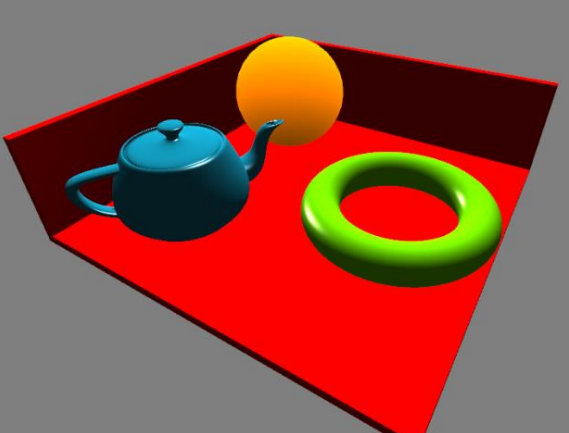

# Renderização de Cena 3D

Trabalho da disciplina de computação gráfica. A tarefa requer a renderização de duas cenas 3D usando a API gráfica OpenGl.

> Primeira cena

## Equipe

- Alexandre Nogueira
- Mario Machado
- Francisca Gardênia
